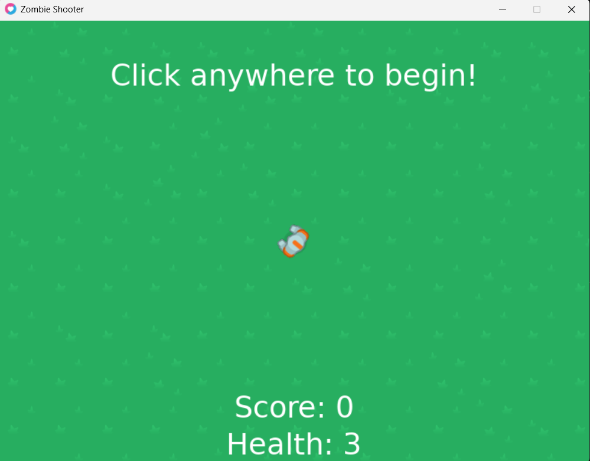
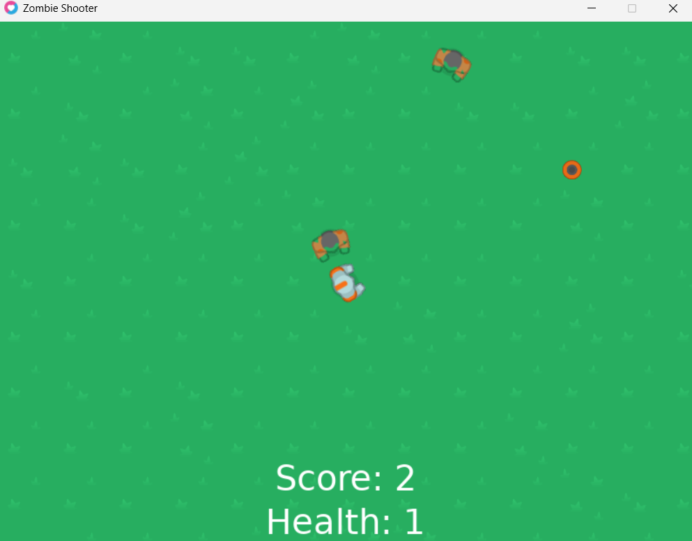
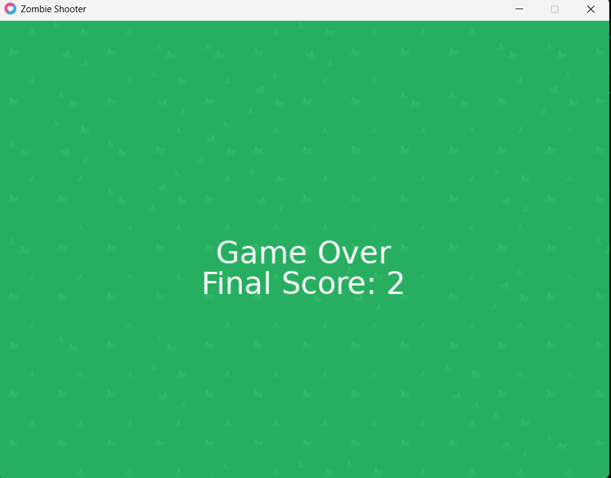

# Zombie Shooter Game
author : AdipramanaDev
years : 2025 

## Overview

**Zombie Shooter** is a simple top-down 2D game where you control a player that must shoot zombies and avoid being hit. The player can move around, shoot bullets, and defeat zombies to increase the score. The game ends when the player’s health reaches zero, and the player can restart the game after a game over.

### Key Features:
- **Player Movement**: Move using the **WASD** keys.
- **Shooting**: Left-click to shoot bullets at zombies.
- **Health System**: The player starts with 3 health points. If the player collides with a zombie, health is reduced. If health reaches zero, the game ends.
- **Zombie AI**: Zombies spawn randomly and move towards the player.
- **Background Music**: The game includes looping background music 
- **Game Over**: When the player’s health reaches zero, the game ends with a "Game Over" screen and final score.


## Installation

### Requirements:
- **Love2D**: This game uses the Love2D framework. You must have [Love2D installed](https://love2d.org/) to run this game.
- **Sound Files**: The game includes sound effects and background music that must be placed in the `sounds/` folder.

### How to Run:
1. Install **Love2D**.
2. Clone or download the repository to your local machine.
3. Place all files in a folder.
4. Open the folder with Love2D or drag the folder onto the Love2D executable to run the game.

---

## How to Play:
- **WASD**: Move the player up, left, down, or right.
- **Left Click**: Shoot bullets.
- **Game Over**: The game ends when your health reaches zero.
- **Restart**: Click anywhere after the game over screen to restart the game.

---

## Code Breakdown

### `love.load()`
This function is called when the game starts. It initializes the player, zombie, and bullet sprites, as well as the game state and background music. It also sets up the player's initial health and movement speed.

```lua
function love.load()
    -- Initialize game window, player, and zombies
    math.randomseed(os.time())
    love.window.setTitle('Zombie Shooter')
    sprites = {}
    sprites.player = love.graphics.newImage('sprites/player.png')
    sprites.bullet = love.graphics.newImage('sprites/bullet.png')
    sprites.zombie = love.graphics.newImage('sprites/zombie.png')
    sprites.background = love.graphics.newImage('sprites/background.png')

    -- Load background music and set it to loop
    backgroundMusic = love.audio.newSource("sounds/background_sounds.mp3", "stream")
    backgroundMusic:setLooping(true)
    love.audio.play(backgroundMusic)
    backgroundMusic:setVolume(0.5) -- Set the volume to 50%

    -- Initialize player attributes
    player = {}
    player.x = love.graphics.getWidth() / 2
    player.y = love.graphics.getHeight() / 2
    player.speed = 180
    myFont = love.graphics.newFont(40)

    -- Initialize game variables
    zombies = {}
    bullets = {}
    gamestate = 1
    score = 0
    maxTime = 2
    timer = maxTime
    player.health = 3
    player.injured = false
end
```

### `love.update(dt)`
This function is called every frame. It updates the player’s movement, handles zombie AI, manages collisions, and checks if the game is over. If the player's health reaches zero, the game enters the "Game Over" state and stops the background music.

```lua
function love.update(dt)
    -- Check if the game is over (health is 0)
    if player.health == 0 then
        if gamestate ~= 0 then -- If gamestate is not already game over
            gamestate = 0 -- Set the game state to game over
            love.audio.stop(backgroundMusic) -- Stop the background music
            backgroundMusic:setVolume(0.1) -- Set the volume to 10%
        end
    end
    -- Update player movement and zombie behavior
    -- Continue with other game logic like collisions, spawning, etc.
end
```

### `love.draw()`
This function handles all the drawing for the game. It draws the background, player, zombies, bullets, health, and score. It also displays a "Game Over" screen when the game ends.

```lua
function love.draw()
    love.graphics.draw(sprites.background, 0, 0)
    
    -- Display Game Over screen if gamestate is 0
    if gamestate == 0 then
        love.graphics.setFont(myFont)
        love.graphics.printf("Game Over", 0, love.graphics.getHeight() / 2 - 20, love.graphics.getWidth(), "center")
        love.graphics.printf("Final Score: " .. score, 0, love.graphics.getHeight() / 2 + 20, love.graphics.getWidth(), "center")
        return  -- Stop drawing other things when game is over
    end
    
    -- Normal gameplay drawing logic
    love.graphics.printf("Score: " .. score, 0, love.graphics.getHeight() - 100, love.graphics.getWidth(), "center")
    love.graphics.draw(sprites.player, player.x, player.y, playerMouseAngle(), nil, nil, sprites.player:getWidth() / 2, sprites.player:getHeight() / 2)
    -- Draw zombies, bullets, and health
end
```

### `love.mousepressed(x, y, button)`
This function handles player input. It starts the game on click, spawns bullets, and restarts the game after a game over.

```lua
function love.mousepressed(x, y, button)
    if button == 1 and gamestate == 2 then
        spawnBullet()
    elseif button == 1 and gamestate == 1 then
        gamestate = 2
        maxTime = 2
        timer = maxTime
        score = 0
        player.health = 3
        player.x = love.graphics.getWidth() / 2
        player.y = love.graphics.getHeight() / 2
        zombies = {}
        bullets = {}
        love.audio.play(backgroundMusic) -- Play background music again
    elseif button == 1 and gamestate == 0 then
        love.audio.stop(backgroundMusic) -- Stop the background music
        gamestate = 2
        maxTime = 2
        timer = maxTime
        score = 0
        player.health = 3 -- Reset health
        player.x = love.graphics.getWidth() / 2
        player.y = love.graphics.getHeight() / 2
        zombies = {}
        bullets = {}
        love.audio.play(backgroundMusic) -- Start playing background music again
    end
end
```

## File Structure:
```
/Zombie-Shooter
    /sprites
        player.png
        bullet.png
        zombie.png
        background.png
    /sounds
        background_sounds.mp3
    main.lua
    README.md
```
## 📸 Screenshot





## License

This game is open-source and available for use under the **MIT License**. Feel free to modify and distribute this game.

## Acknowledgements

- **Love2D**: This game is built using the [Love2D](https://love2d.org/) framework.
- **Background Music**: The background music is sourced from royalty-free audio libraries. (Make sure to replace it with your own music if you plan to distribute this game.)

Happy Coding ... 
